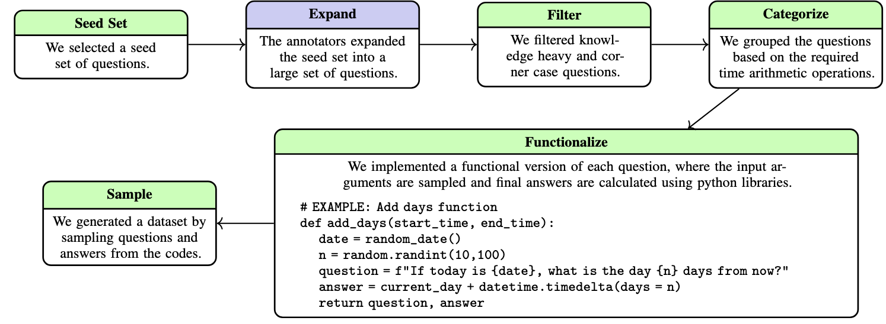
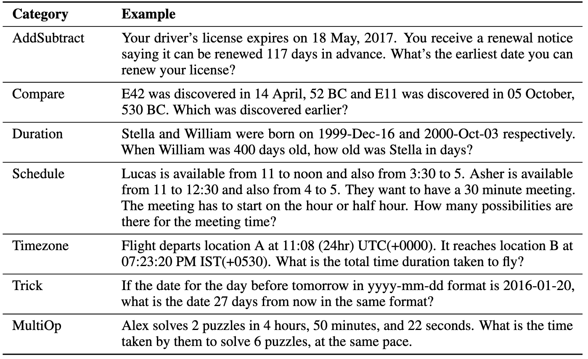

## Overview

- Change of ranking when applying TEA
- Synthetic dataset to assess temporal arithmetic (physics of time)

# Change of ranking

## Experiment setup

- Extended TEA to PaLM 2 and Llama 2 from paper (2nd & 3rd best model)
    - All using few shot + CoT
- Could reuse pipeline with minor changes
- Failed to integrate FlanT5 due to bad output 
- Note, Llama 2 dataset incomplete. Half the data is missing.
    - Authors contacted. This experiment seems cursed ...

## Model ranks with traditional metrics

- Scores for respective subsets of the head dataset
- I used the authors evaluation procedure

|Model  | F1  | ROUGE1 | ROUGE2 | METEOR | Exact Match |
| ----- | --- | ------ | ------ | ------ | ----------- |
|GPT-4  |72.30| 70.51  | 72.34  | 72.33  | 52.06       |
|PaLM 2 |69.33| 63.93  | 69.26  | 69.23  | 47.35       |
|Llama 2|57.85| 56.17  | 57.82  | 57.81  | 42.33       |

## Model ranks with TEA

|Model  | Rel. err.  | Std.   |
| ----- | ---------- | ------ |
|PaLM 2 |0.72        | 14.06  |
|GPT-4  |3.6         | 75.14  |
|Llama 2|13.53       | 139.93 |

::: {.fragment}
___
|Model  | F1  |
| ----- | --- |
|GPT-4  |72.30|
|PaLM 2 |69.33|
|Llama 2|57.85|
:::

## Model biases shown by TEA

- GPT-4 tends to overshoot (~120:70)
- PaLM 2 and Llama 2 tend to undershoot (~130:100)
- Relative error for all models larger for errors > 0

## My thoughts

- Interpretation of TEA is more intuitive than F1
- Ranking and spacing between models changes
    - TEA captures something F1 and co. don't    
- TEA especially strong when model is incorrect
    - Plausible since F1 score is the same for "10 years", "20 years", "1995 years" if the expected answer is "5 years"

## Problems with FlanT5

::: {.incremental}
- Hard to extract final numeric answer
- Model's output did not answer question, had too many digits, or was truncated
    - E.g., "The last time Art Carney was married was in 1977. He died in 2003. So,"
- Too many digits: 
    - Used spaCy's NER to identify expected entity and extract the same from answer
    - Unsuccessful as answers often were very wrong and NER not precise enough
- Discard weaker models for now
:::

---

- How should I  conduct TEA if output is entirely wrong?
- Could discard such examples and report separately
- Could keep them to see when a TEA of inf. (answer amiss) does not yield F1 of 0
- Started LLM as a Judge but did not get far due to busy queue

---

- Ran small LLM as a Judge experiment:
    - Given a question, answer, and predicted answer, identify the most relevant numeric value from the predicted answer to the question. 
    - Calculate the difference between this value and the expected answer.  
- Tested with R1-Distill-Qwen-32B
- Instruction following bad. It tries to solve the question itself instead of extracting a value from the prediction

# Synthetic dataset

## Test of Time

- The _Test of Time_ (ToT) dataset was published as a pre-print last summer and accepted for ICLR 2025
- Consists of temporal _arithmetic_ benchmark and temporal _semantic_ benchmark

## Arithmetic dataset creation

## Example questions

## Semantic dataset creation

- Uses graph-generation algorithms to develop timelines and relations
- Questions generated based on graph and pre-defined problems (e.g., _EventAtTimeT_, _BeforeAfter_, ...)
- Mostly not suitable for TEA since asking for entities (nodes) or relations (edges)
- _RelationDuration_ and _EventAtWhatTime_ subset can be used
    - "At what time did E69 start being the R90 of E22?"
    - "When E24 was the R53 of E11 for the 2nd time, for how many years did the relation last?"

## Pros/cons of using ToT

- Authors use frontier models like Claude-3-Sonnet, GPT-4 Gemini, 1.5 Pro and still observe performance gaps
- Most recent temporal benchmark I know of
- Application of TEA promising since authors reported bias towards and error of ±1 day
    - No in-depth analysis on other temporal errors

---

- Disadvantage: Model outputs and code has not yet been uploaded
- I plan to contact the authors and hope for the best
- Question: Should I reveal that I work on TEA? Feels like they could easily scoop given the work they have done so far.

## Alternatives

- _ChronoSense_
    - Like ToT, benchmarks temporal semantic and arithmetic
    - Semi-synthetic, using Wikipedia from Wikipedia data
    - Not useable since benchmark is binary

---

- _TGQA_
    - Semi-synthetic data generation from Wikipedia
    - NER scrambling to avoid memorisation 
    - Knowledge-graph based
    - Only two sub-categories ask for temporal answer. Rest is event-focused

---

- _UnSeenTimeQA_
    - Synthetic dataset generating question similar to International Planning Competitions
    - Given adequate context, questions may look like this: "If loading package p1 into truck t0 at location l0_1 starts at 03:13 PM, where is the package p1 at 06:07 AM?"
    - Coverage of temporal problems unclear otherwise interesting

